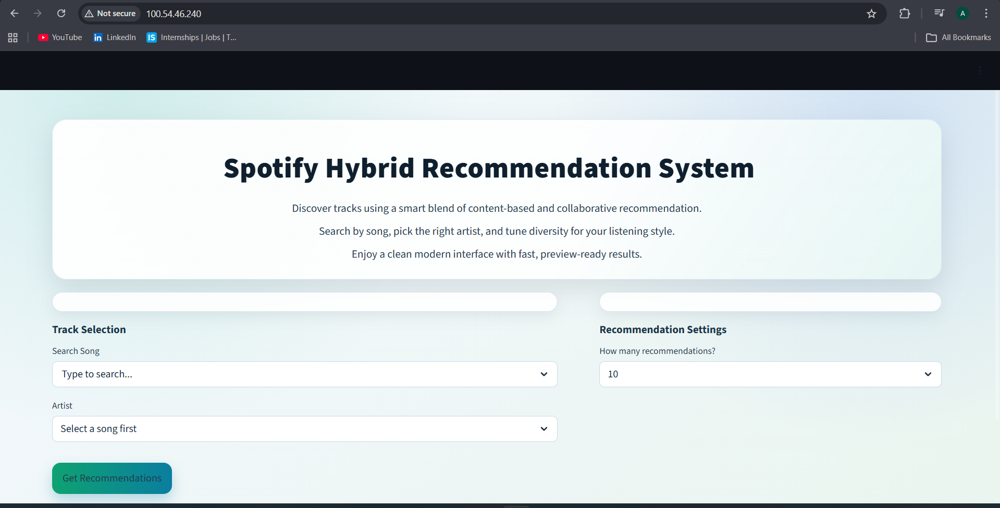
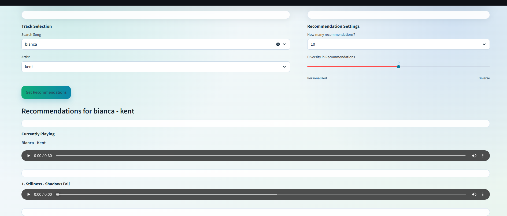

p align="center">
  <a href="https://github.com/AbhaySingh71/Spotify-Hybrid-Recommender-System-MLOPS">
    
  </a>
  <a href="https://hub.docker.com/repository/docker/abhaysingh71/spotify-recommender-system/general">
    
  </a>
</p>

# Spotify Hybrid Recommendation System

A production-oriented music recommendation platform that combines **content-based filtering** and **collaborative filtering** into a **hybrid recommender**, delivered through a Streamlit application and operationalized with a modern MLOps stack: **DVC, Docker, GitHub Actions, Amazon ECR, AWS CodeDeploy, and EC2-based runtime infrastructure**.

## Overview

This system generates recommendations using complementary ML signals:

- **Content-based filtering**: Similarity across song metadata and audio attributes.
- **Collaborative filtering**: Similarity from user-listening interaction behavior (`playcount`).
- **Hybrid scoring**: Weighted blend of both similarity spaces, controlled by a user-facing diversity slider.

The application gracefully falls back to content-based inference when collaborative signals are unavailable for a selected track.

|  |  |
|---------------------------------|---------------------------------|

## Production Highlights

- Zero-downtime deployment pattern with **Blue-Green** rollout support.
- **Auto scaling** capable runtime using EC2 Auto Scaling Group.
- **Fault tolerance** through load-balanced multi-instance serving and health-based replacement.
- **Containerized deployment** with Docker images stored in Amazon ECR.
- **Reproducible ML artifacts** and data lineage via DVC.

## Features

- Streamlit interface with search, artist disambiguation, and recommendation controls.
- Audio preview playback (`spotify_preview_url`) in result cards.
- DVC pipeline for reproducible data artifacts.
- Sparse matrix representations (`.npz`) for scalable similarity computation.
- CI/CD workflow that:
  - pulls DVC data,
  - runs app smoke tests,
  - builds and pushes a Docker image to ECR,
  - triggers AWS CodeDeploy.

## MLOps Architecture

### 1. Amazon ECR (Container Registry)

- CI builds a versioned Docker image of the application runtime and model-serving code.
- Image is pushed to **Amazon Elastic Container Registry (ECR)** as the deployable artifact.
- ECR provides a secure and centralized artifact registry across environments.

### 2. GitHub Actions CI/CD

Defined in `.github/workflows/ci.yaml`, the pipeline automates:

- source checkout,
- Python + `uv` environment setup,
- dependency installation,
- `dvc pull` for tracked data/model artifacts,
- Streamlit smoke validation via `pytest`,
- Docker build + ECR push,
- deployment package upload to S3,
- deployment trigger via AWS CodeDeploy.

This turns every eligible push into a reproducible delivery event.

### 3. AWS CodeDeploy Integration

- CodeDeploy orchestrates release execution using `appspec.yml` lifecycle hooks.
- `BeforeInstall`: host bootstrap (`install_dependencies.sh`).
- `ApplicationStart`: pulls the latest ECR image and starts/replaces the container (`start_docker.sh`).

### 4. Blue-Green Deployment Strategy (Zero Downtime)

- Production is modeled as two environments: **Blue (active)** and **Green (candidate)**.
- New container revision is launched on Green capacity.
- Health checks validate Green before traffic transition.
- Traffic is shifted from Blue to Green only after successful validation.
- If health checks fail, deployment can be rolled back to Blue to avoid user-visible downtime.

### 5. EC2 Auto Scaling Group

- Application instances can run as an **Auto Scaling Group (ASG)** for elastic capacity.
- ASG scales out during demand spikes and scales in during low traffic windows.
- Unhealthy instances are replaced automatically to maintain desired capacity.

### 6. Application Load Balancer (Elastic Load Balancing)

- **ALB** fronts application instances and distributes traffic across healthy targets.
- Works with target groups to support Blue-Green traffic switching.
- Enables high availability and smoother release transitions.

### 7. Health Checks and Rollback Strategy

- ALB and CodeDeploy health checks gate traffic progression.
- Failed validation blocks or reverts rollout.
- Rollback restores prior stable revision, minimizing service interruption and deployment risk.

## AWS Infrastructure Architecture

### Deployment Flow

```text
GitHub Repo
   -> GitHub Actions CI
   -> Docker Build
   -> Amazon ECR (Image Registry)
   -> AWS CodeDeploy (Release Orchestration)
   -> EC2 / Auto Scaling Group (Runtime Hosts)
   -> Application Load Balancer (Traffic Entry)
   -> End Users
```

### Traffic Shifting in Blue-Green

- Green environment is provisioned with the new version.
- Validation and health checks run before exposure.
- ALB target-group routing shifts traffic from Blue to Green.
- On failure, traffic remains on or returns to Blue automatically.

### High Availability and Scalability

- Multi-instance serving behind ALB improves availability.
- ASG enables horizontal scaling and self-healing.
- Immutable container releases improve consistency across nodes.

## Project Structure

```text
.
+-- app.py                              # Streamlit app
+-- data_cleaning.py                    # Cleans raw music metadata
+-- content_based_filtering.py          # Feature engineering + content similarity
+-- collaborative_filtering.py          # Interaction matrix + collaborative similarity
+-- hybrid_recommendations.py           # Hybrid score blending
+-- transform_filtered_data.py          # Content transform for collab-filtered subset
+-- dvc.yaml                            # Reproducible pipeline definition
+-- Dockerfile                          # Containerized app runtime
+-- .github/workflows/ci.yaml           # CI/CD pipeline
+-- appspec.yml                         # CodeDeploy app spec
+-- deploy/scripts/
    +-- install_dependencies.sh         # EC2 host setup for Docker/AWS CLI
    +-- start_docker.sh                 # Pulls image from ECR and runs container
```

## Data and Artifacts

Raw/managed datasets are tracked with DVC pointers:

- `data/Music Info.csv`
- `data/User Listening History.csv`

Pipeline-generated artifacts:

- `data/cleaned_data.csv`
- `data/transformed_data.npz`
- `transformer.joblib`
- `data/collab_filtered_data.csv`
- `data/track_ids.npy`
- `data/interaction_matrix.npz`
- `data/transformed_hybrid_data.npz`

## Recommendation Pipeline

1. **Data cleaning** (`data_cleaning.py`)
- Deduplicates by `track_id`
- Drops unused columns (`genre`, `spotify_id`)
- Normalizes text fields to lowercase

2. **Content feature transformation** (`content_based_filtering.py`)
- `CountEncoder` on `year`
- `OneHotEncoder` on `artist`, `time_signature`, `key`
- `TF-IDF` on `tags`
- `StandardScaler` + `MinMaxScaler` on numeric audio features
- Saves `transformer.joblib` and `data/transformed_data.npz`

3. **Collaborative matrix creation** (`collaborative_filtering.py`)
- Builds track-user sparse matrix from listening history (`playcount`)
- Saves matrix and aligned track IDs
- Produces collab-supported song subset

4. **Hybrid transform subset** (`transform_filtered_data.py`)
- Applies trained content transformer to the collab-supported subset
- Saves `data/transformed_hybrid_data.npz`

5. **Hybrid inference** (`hybrid_recommendations.py` + `app.py`)
- Computes cosine similarities in both spaces
- Normalizes both scores
- Combines via weighted average:

```text
hybrid_score = w_content * content_similarity + (1 - w_content) * collaborative_similarity
```

## Local Setup

### Prerequisites

- Python **3.12+**
- [uv](https://docs.astral.sh/uv/)
- DVC with S3 remote access configured (for pulling data/artifacts)
- AWS credentials (if your DVC remote is S3)

### Install Dependencies

```bash
uv sync
```

### Pull DVC Data

```bash
uv run dvc pull
```

### Run Streamlit App

```bash
uv run streamlit run app.py --server.port 8000
```

Open: `http://localhost:8000`

### Run Tests

```bash
uv run pytest test_app.py
```

## Reproduce Data Pipeline

Run all stages:

```bash
uv run dvc repro
```

Or run individual scripts in order:

```bash
uv run python data_cleaning.py
uv run python content_based_filtering.py
uv run python collaborative_filtering.py
uv run python transform_filtered_data.py
```

## Docker

Build and run locally:

```bash
docker build -t spotify-hybrid-recsys .
docker run --rm -p 8000:8000 spotify-hybrid-recsys
```

## CI/CD and Deployment

Defined in `.github/workflows/ci.yaml`:

- Checkout code
- Setup Python + uv
- Install dependencies
- Pull DVC artifacts
- Start Streamlit and run smoke test (`test_app.py`)
- Build and push Docker image to Amazon ECR
- Upload deployment bundle to S3
- Trigger AWS CodeDeploy deployment

CodeDeploy hooks:

- `deploy/scripts/install_dependencies.sh`: installs Docker + AWS CLI on host.
- `deploy/scripts/start_docker.sh`: logs into ECR, pulls latest image, replaces container, maps port `80 -> 8000`.

## Notes

- Large data files are not expected to live directly in Git; use `dvc pull`.
- Collaborative recommendations depend on track presence in listening history; otherwise the app uses content-based mode.

## License

This project is licensed under the terms in [LICENSE](LICENSE).
